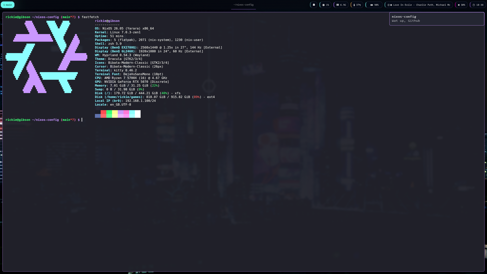

# NixOS Configuration

Welcome to my NixOS config repo.

This contains a personal Nix flake for managing both NixOS and macOS (nix-darwin) system types, and any server builds I may wish to add.



The repo is public as a rebuild reference for myself, and in case anything here is useful to someone else stumbling across it. It won't work out of the box for anyone — it's built around my hardware, with anything sensitive locked behind YubiKey, and a private secrets repo. 3rd Party PR requests wont be taken, but feel free to use any code in the repo as you see fit in your own Nix-based projects!

---

## Hosts

| Host | Platform | System | Description |
|---|---|---|---|
| `gibson` | NixOS | x86_64-linux | Main NixOS PC |
| `attic` | NixOS | x86_64-linux | Attic Cache under Proxmox PCT |
| `macbook` | nix-darwin | aarch64-darwin | M2 Macbook Air |

---

## Structure

```
.
├── flake.nix                  # Entrypoint — flake-parts + import-tree
├── flake/
│   ├── hosts/                 # Per-host declarations (kind, system, profiles)
│   ├── parts/                 # Flake-parts modules (outputs, platforms, features)
│   └── lib/
├── hosts/                     # Host-specific system, home, disko, overlays
├── features/                  # Feature modules — home and system
├── profiles/                  # Profile compositions — groups of features per host class
├── pkgs/                      # Custom packages
└── bootstrap/
    └── install.sh             # Bootstrap entrypoint; use with --help for assistance
    └── deploy-attic.sh        # Attic-specific deployment script
```

The config follows the [dendritic pattern](https://saylesss88.github.io/flakes/dendritic_flake_parts.html) — features are small, self-contained modules composed into hosts via profiles rather than monolithic per-host config files. [flake-parts](https://github.com/hercules-ci/flake-parts) and [import-tree](https://github.com/vic/import-tree) handle the wiring.

---

## Secrets

Nothing sensitive lives here. Secrets are managed via [sops-nix](https://github.com/Mic92/sops-nix) + `age`, sourced from a private `nix-secrets` repo. The age identity is encrypted to a YubiKey (PIV, via `age-plugin-yubikey`), which is also the root of trust for SSH and GPG. The bootstrap script handles cloning secrets and placing the decrypted age key on a fresh system that has a valid hardware key — see `bootstrap/install.sh --help`.

---

## Rebuilds

```sh
# NixOS
sudo nixos-rebuild switch --flake ~/nixos-config#gibson

# macOS
darwin-rebuild switch --flake ~/nixos-config#macbook
```

---

## References

- [sops-nix](https://github.com/Mic92/sops-nix)
- [nix-darwin](https://github.com/LnL7/nix-darwin)
- [home-manager](https://github.com/nix-community/home-manager)
- [flake-parts](https://github.com/hercules-ci/flake-parts)
- [disko](https://github.com/nix-community/disko)
- [age-plugin-yubikey](https://github.com/str4d/age-plugin-yubikey)
