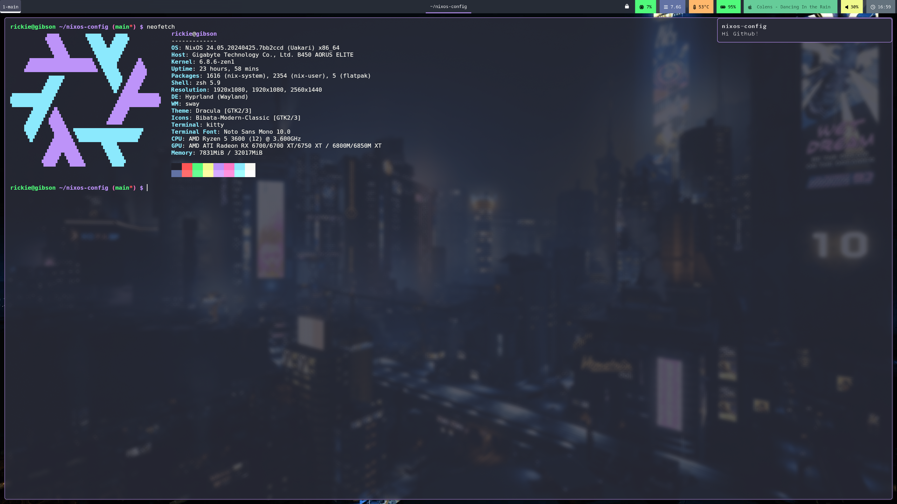

# Menu

- [Introduction](#nixos-config)
- [Applications](#applications)
- [Installation](#installation)
- [Screenshot](#screenshot)

# NixOS Config
**TL/DR**

*This is a work-in-progress NixOS system repo! The nix-based reproducability aspect of it is unlikely to work for most other people without diving into/adjusting the code itself.*

Hi there, thanks for checking out my Nix config. I'm pretty new to the OS (circa beginning of 2024), so there's probably a lot that will change or move around in this repo. There are also a tonne of improvements I can make, with time, so to any Nix aficionados out there: "Be Nice" if you scrutinise my setup :D

My configurations namely revolve around applications using vim-style keybindings, and I tend to use Dracula theme/colour-scheme. This is (mostly) all defined declaratively using Nix. In the cases where files may contain sensitive information (e.g. gnupg private keys), I use [sops-nix](https://github.com/Mic92/sops-nix) to encrypt the data. These secrets are stored in a private repository, despite their state of encryption, as an added security layer.

Note: this code is mainly available online to allow for version control (and inherent backup), and it may also be useful as a reference to others who use NixOS. Outside of that, though, the system will build around things I've obviously tailored to my liking and the hardware setup I have so please bear that in mind before you attempt to just switch to this configuration. I can't offer support on things you can't get working so please do not ask. NixOS has an incredible online community across a myriad of different platforms that can be leveraged/utilised for assistance if you require it.

Thanks for looking!

### Applications

Here are a list of the current applications I use (other config files may be also added to this repo over time):

- *Compositor:* [Hyprland](https://github.com/hyprwm/hyprland) / [Wayland](https://gitlab.freedesktop.org/wayland/wayland)
- *Notifications:* [mako](https://github.com/emersion/mako)
- *Bar:* [Waybar](https://github.com/Alexays/Waybar)
- *Menu:* [Fuzzel](https://codeberg.org/dnkl/fuzzel)
- *Player* [Cider](https://github.com/ciderapp/Cider)
- *Passwords* [Pass](https://www.passwordstore.org/) / [Bitwarden](https://github.com/bitwarden/clients)
- *Shell:* [Kitty](https://github.com/kovidgoyal/kitty) 
- *Browser:* [Qutebrowser](https://github.com/qutebrowser/qutebrowser)
- *Screenshots*: [Grimblast](https://github.com/hyprwm/contrib/tree/main/grimblast)

Other well know software such as Discord/Signal and Wine/Mesa packages are included (as I run AMD hardware). Most other things should also be included declaratively.

### Installation

**WIP - NEEDS TESTING**

As stated, this code repo is designed for deployment of my main NixOS system. It is based around flakes and, therefore, should theoretically be reproducable using the following:

``` sh
MOUNT="/dev/sdX"

sudo nix \
    --extra-experimental-features 'flakes nix-command' \
    install \
    --flake "github:5ysk3y/dotfiles#gibson" \
    --write-efi-boot-entries \
    --disk main /dev/sdX
```
> Spoilers - this probably wont work but I'll leave it here anyway :D

***

### Screenshot


